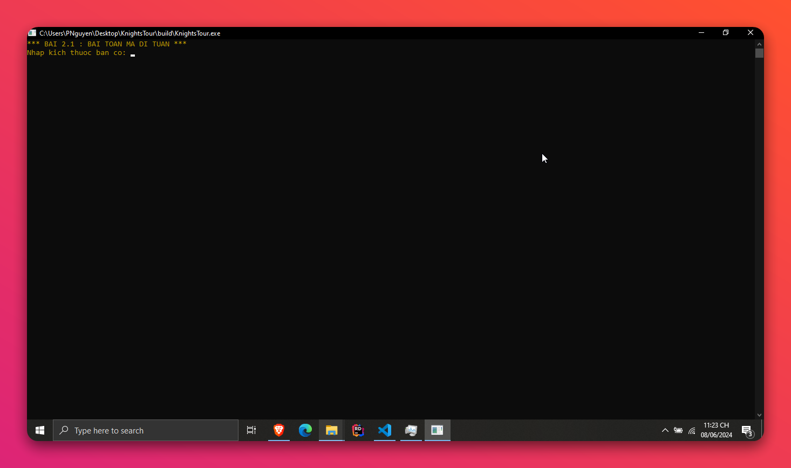
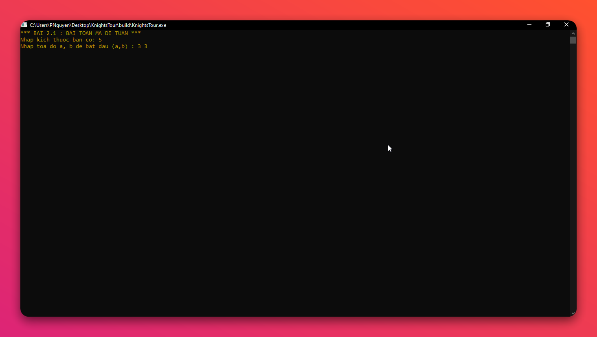
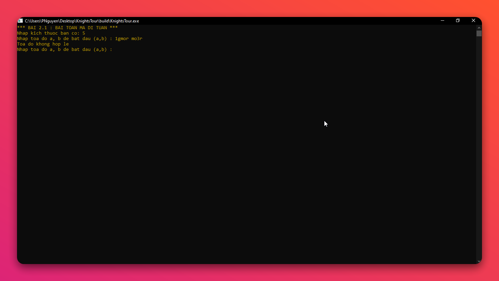
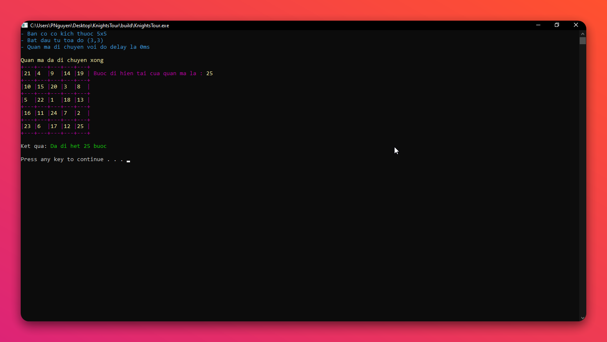
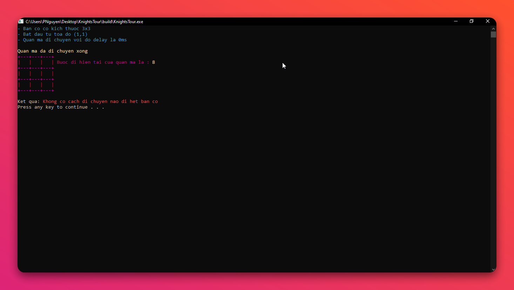

# KnightsTour

<h6> Knight's Tour Animation </h6>

    
&#128221; Table of Contents

- [KnightsTour](#knightstour)
  - [:hammer: Build with](#hammer-build-with)
  - [:pushpin: Description](#pushpin-description)
  - [:tada: Features](#tada-features)
  - [:pencil2: Authors](#pencil2-authors)

## :hammer: Build with

## :pushpin: Description

Đây là chương trình giải bài toán `Knight's Tour`, là một phần của đồ án môn học **Cấu trúc dữ liệu và giải thuật**, tại trường **Học viện Công nghệ Bưu chính Viễn thông Cơ sở tại TP.HCM**, dưới sự hướng dẫn của giảng viên **cô Dương Thanh Thảo**.

- Yêu cầu bài toán:

> - Cho bàn cờ có kích thước n x n ô:
> - Xây dựng chức năng cho phép người dùng nhập các thông tin:
>
>   - Kích thước bàn cờ n
>   - Vị trí xuất phát của con mã là ô **(u,v) với u, v <= n-1**
>
> a. Dùng mảng 2 chiều có kích thước n x n để lưu trữ bàn cờ
> b. Viết chương trình liệt kê các nước đi của con mã để nó đi qua tất cả các ô của bàn cờ, mỗi ô đúng 1 lần.
> c. Hiển thị kết quả các nước đi của con mã theo định dạng:
>
> - k : (u,v)  -> con mã đi nước thứ k ở ô (u,v).

  :bulb: **Note:**
  >
  > 1. Để cải thiện về mặt liên tưởng, nhóm đề xuất thay vì hiển thị kết quả dưới dạng danh sách, nhóm quyết định hiển thị kết quả trên bàn cờ.
  > 2. Nhóm thay đổi xuất phát của quân mã từ `ô (u,v) với u, v <= n-1` thành `ô (u,v) với u, v <= n` để đơn giản hóa việc nhập liệu và hiển thị kết quả.

## :tada: Features

- Mô tả:
  - Chương trình giải bài toán `Knight's Tour` có giao diện đồ họa console.
- Cách hoạt động:
  - `Click vào file KnightsTour.exe` để chạy chương trình.
  - Người dùng nhập vào kích thước bàn cờ .

    <figure> <figcaption>Nhập kích thước bàn cờ</figcaption> </figure>

  - Người dùng nhập vào vị trí xuất phát của quân mã.
  
    <figure> <figcaption>Nhập vị trí xuất phát của quân mã</figcaption> </figure>

  - Chương trình sẽ tìm kiếm một đường đi của quân mã trên bàn cờ sao cho quân mã đi qua mỗi ô trên bàn cờ đúng một lần.
  - Nếu tìm thấy đường đi, chương trình sẽ hiển thị bàn cờ với đường đi của quân mã.
  - Nếu không tìm thấy đường đi, chương trình sẽ thông báo không tìm thấy đường đi.
  > :bulb: **Note:**:
  > 1. Bàn cờ được biểu diễn bằng ma trận.
  > 2. Mỗi ô trên bàn cờ biểu diễn `số thứ tự` của nước đi của quân mã.
  > 3. Quân mã bắt đầu từ vị trí từ người dùng nhập vào, vị trí này biểu diễn như sau, cho `n` là kích thước bàn cờ:
    >    - Dòng: `1` đến `n`.
    >    - Cột: `1` đến `n`.
    >    - Ví dụ: `1 1` biểu diễn vị trí đầu tiên của quân mã ở góc trên bên trái của bàn cờ.
  > 4. Các dữ liệu nhập vào phải hợp lệ, nếu không chương trình sẽ thông báo lỗi và yêu cầu nhập lại (kiểu dữ liệu `int`)
  >  
  > <figure> <figcaption>Lỗi dữ liệu</figcaption> </figure>
  </figure>

- Kết quả:
  - Nếu tìm thấy đường đi, chương trình sẽ hiển thị bàn cờ với đường đi của quân mã.
  - Nếu không tìm thấy đường đi, chương trình sẽ thông báo không tìm thấy đường đi.
  
  <figure> <figcaption>Kết quả tìm thấy đường đi</figcaption> </figure>

    <figure> <figcaption>Kết quả không tìm thấy đường đi</figcaption> </figure>

## :pencil2: Authors

- [@Phunguy65](https://github/Phunguy65) - Nguyễn Ngọc Phú
- [@Anroyi](https://github/Anroyi) - Trần Hùng
- [@hnihTyoB](https://github/hnihTyoB) - Nguyễn Chí Thịnh
- [@tungbeoiotptithcm](https://github.com/tungbeoiotptithcm) - Nguyễn Thanh Tùng
- [@WhizKid](https://github.com/tuannguyen1229) - Nguyễn Như Tuấn
